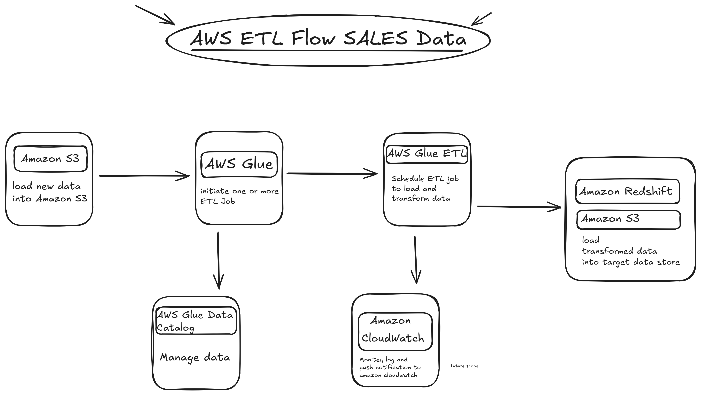

# Sales Data ETL Pipeline with AWS Glue and Redshift



## Project Overview
An automated ETL pipeline that processes sales data from CSV files in S3, transforms it using AWS Glue, and loads aggregated results into Amazon Redshift for analytics.

## Key Features
- **Automated Data Processing**: Scheduled ETL jobs for regular data updates
- **Data Quality Checks**: Null value handling and schema validation
- **Multi-dimensional Aggregation**: Sales metrics by region, country, and time periods
- **Scalable Infrastructure**: Glue workers configured for parallel processing
- **Data Catalog Integration**: Central metadata management

## Technical Architecture
```mermaid
graph TD
    A[S3 Source Data] --> B[AWS Glue ETL]
    B --> C[Data Transformations]
    C --> D[Redshift Target]
    B --> E[Glue Data Catalog]
    D --> F[Analytics & Reporting]
    E --> F
    B --> G[CloudWatch Monitoring]
